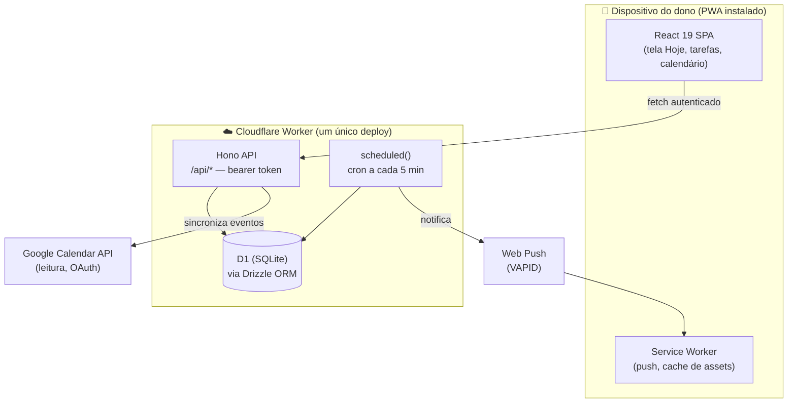

<div align="center">


# Praesto Sum

**_"Praesto sum"_ — Latim para "Estou pronto, ao seu dispor."**

Um assistente pessoal construído por um único usuário, para um único usuário: organizar tarefas e calendário em um só lugar, sem depender de um punhado de apps que nunca conversam entre si.

[](documentation/50-planning/roadmap.md)
[](documentation/50-planning/roadmap.md)
[](#-stack-t%C3%A9cnica)
[](#-licença)

</div>

---

## 📖 Sobre o projeto

A maioria das pessoas organiza a vida espalhada entre um app de calendário, um ou mais apps de tarefas e anotações soltas em algum lugar. Cada ferramenta guarda um pedaço da história; nenhuma guarda o todo. O resultado é retrabalho, compromissos esquecidos e o usuário se adaptando à ferramenta — em vez do contrário.

**Praesto Sum** nasce para resolver isso para o seu único usuário: uma assistente que começa pelo básico (tarefas e calendário) e cresce, uma "Área da Vida" por vez, até se tornar a visão única e confiável de tudo que precisa ser organizado. Os princípios do produto:

1. **Simplicidade acima de completude** — um conjunto pequeno de funcionalidades que funcionam todo dia vale mais que um catálogo grande que fica parado.
2. **Os dados são do dono, sob controle do dono** — armazenamento explícito, com exportação local garantida.
3. **Sustentável para uma pessoa manter** — complexidade que uma única pessoa não consegue carregar está fora de escopo.
4. **A assistente se adapta ao dono, não o contrário.**
5. **Fácil de entrar, fácil de sair** — capturar e encontrar informação precisa ser quase instantâneo.
6. **Espelho honesto** — compromissos perdidos repetidamente são mostrados, nunca escondidos.

📚 Toda a fundamentação de produto e arquitetura vive em [`documentation/`](documentation/README.md) — visão, requisitos, decisões arquiteturais (ADRs) e roadmap, tudo validado pelo dono do projeto antes de virar código.

## ✨ Funcionalidades

| Funcionalidade | Status | Descrição |
|---|:---:|---|
| **Instalação como app (PWA)** | ✅ | Ícone na tela inicial do celular, funciona como um app nativo |
| **Captura rápida de tarefas** | ✅ | Criar, listar, concluir, editar e excluir tarefas sem fricção |
| **Detalhe da tarefa** | ✅ | Título, descrição, prazo, data agendada, prioridade |
| **Tela "Hoje"** | 🚧 | O que precisa de atenção hoje: atrasadas, de hoje, futuras e sem data — com filtros por status, data e prioridade |
| **Leitura do Google Calendar** | 🚧 | Compromissos reais do Google aparecem ao lado das tarefas, com autorização única e desconexão a qualquer momento |
| **Exportação de dados** | 📋 | Um clique baixa 100% dos dados em JSON + `.ics`, sempre sob controle do dono |
| **Notificações push** | 📋 | O celular toca mesmo com o app fechado |
| **Lembretes** | 📋 | "Beber água às 15h" ou "avisar 1h antes do prazo", entregues no horário |
| **Recorrência de tarefas** | 📋 | Séries recorrentes com faltas registradas, nunca escondidas |
| **Escrita no Google Calendar** | 📋 | Criar/editar compromissos a partir do próprio Praesto (Fase 2) |
| **Novas Áreas da Vida** | 💭 | Notas e outras áreas, além de Tarefas e Calendário |

✅ entregue · 🚧 em progresso · 📋 planejado · 💭 ideia futura — veja o detalhamento completo em [`documentation/50-planning/roadmap.md`](documentation/50-planning/roadmap.md).

## 🏗️ Arquitetura

Um único Cloudflare Worker serve tudo: os assets estáticos do SPA, a API REST e o cron de notificações. Sem backend separado, sem serviço de sincronização, sem escrita offline.



**Padrões-chave** (detalhados em [`documentation/30-architecture/architecture-overview.md`](documentation/30-architecture/architecture-overview.md)):

- Tipos fluem de `src/worker/db/schema.ts` (Drizzle) para fora; `src/worker/dto.ts` é o único ponto de mapeamento para o contrato de rede em `src/shared/api.ts`.
- Enums de domínio são reforçados duas vezes: união de TypeScript + `CHECK` no SQL.
- Sem conta multiusuário — um único bearer token protege toda a API.

## 🧰 Stack técnica

| Camada | Tecnologia |
|---|---|
| Runtime | [Cloudflare Workers](https://workers.cloudflare.com/) (plano gratuito) + D1 + cron triggers |
| Frontend | React 19 + TypeScript (strict) + Vite + `vite-plugin-pwa` |
| API | [Hono](https://hono.dev/) 4, com bearer token em toda rota |
| Banco de dados | Cloudflare D1 (SQLite) via [Drizzle ORM](https://orm.drizzle.team/) |
| Notificações | `web-push` (VAPID) sob `nodejs_compat` |
| Testes | Vitest + `@cloudflare/vitest-pool-workers` |
| Qualidade | TypeScript strict, ESLint, Prettier |
| Dev container (opcional) | Docker Compose ([ADR-0012](documentation/60-decisions/ADR-0012-optional-docker-compose-local-dev-runtime.md)) |

Versões exatas (sem `^`/`~`) em [`package.json`](package.json) — upgrades são eventos deliberados, nunca acidentais.

## 🚀 Como instalar

### Pré-requisitos

- **Node.js 24+** (traz o npm)
- **git**
- Uma conta [Cloudflare](https://dash.cloudflare.com/sign-up) (plano gratuito) — necessária apenas para deploy e migrações remotas; o desenvolvimento local não precisa dela
- *(opcional)* [Docker Desktop](https://www.docker.com/products/docker-desktop/), se preferir o [ambiente containerizado](documentation/40-engineering/dev-environment.md#o-container-de-dev)

### Passo a passo

```bash
# 1. Clonar o repositório
git clone https://github.com/fabiombarreto/praesto-sum.git
cd praesto-sum

# 2. Instalar dependências (versões exatas do lockfile)
npm ci

# 3. Configurar variáveis locais
cp .dev.vars.example .dev.vars
```

Edite o `.dev.vars` gerado:

```bash
# Qualquer string — é o "token" que você vai colar no app uma vez por dispositivo
API_BEARER_TOKEN="escolha-uma-string-aleatoria"

# Gere com: npx web-push generate-vapid-keys --json
VAPID_SUBJECT="mailto:voce@example.com"
VAPID_PUBLIC_KEY="..."
VAPID_PRIVATE_KEY="..."

# Opcional nesta fase — necessário só para a integração com Google Calendar
GOOGLE_CLIENT_ID=
GOOGLE_CLIENT_SECRET=
GOOGLE_REDIRECT_URI=
```

```bash
# 4. Aplicar as migrações no banco D1 local
npm run db:migrate

# 5. Subir tudo em um processo só: Vite HMR + workerd real + D1 local
npm run dev
```

Abra **http://127.0.0.1:5173** — o app já funciona como PWA (instalável pelo navegador).

> Alternativa: `npm run docker:up` sobe o mesmo ambiente dentro do Docker Compose (sobrevive a reboot, tem `status`/`down` próprios). Detalhes em [`documentation/40-engineering/dev-environment.md`](documentation/40-engineering/dev-environment.md#the-dev-container--the-optional-second-door-adr-0012).

## 🕹️ Como usar

1. Acesse o app pelo navegador (ou instale-o na tela inicial — botão "Adicionar à tela inicial"/"Instalar app").
2. Na primeira vez, cole o `API_BEARER_TOKEN` que você definiu — isso autentica o dispositivo, sem necessidade de conta ou senha.
3. Capture uma tarefa direto na tela **Hoje**: título é o único campo obrigatório.
4. Abra a tarefa para adicionar descrição, prazo, data e prioridade, concluir, reabrir ou excluir.
5. Filtre por status, data ou prioridade para responder rápido "o que preciso fazer hoje?".

## 🧪 Comandos essenciais

| Comando | O que faz |
|---|---|
| `npm run dev` | Ambiente de desenvolvimento completo (HMR + Worker real + D1 local) |
| `npm test` | Roda a suíte de testes (Vitest) |
| `npm run check` | Gate de qualidade: tipos + `tsc -b` + lint + formatação |
| `npm run db:generate` | Gera uma migração a partir de mudança no schema (Drizzle) |
| `npm run db:migrate` | Aplica migrações no D1 local |
| `npm run build` | Build de produção (client + Worker + service worker) |
| `npm run deploy` | Build + `wrangler deploy` (assets + API + cron, um único Worker) |

Lista completa e o runbook de deploy em [`documentation/40-engineering/dev-environment.md`](documentation/40-engineering/dev-environment.md).

## 📂 Estrutura do projeto

```
src/
├── app/          # SPA React (telas, componentes, hooks, PWA)
├── worker/       # API Hono, schema Drizzle, push, integração Google
└── shared/       # Contrato de API compartilhado entre app e worker
documentation/    # Fonte da verdade: visão, requisitos, ADRs, roadmap
migrations/       # Migrações SQL geradas pelo drizzle-kit
```

## 📄 Documentação

Este README é a porta de entrada. O projeto é **documentation-first**: todo requisito, decisão e regra de domínio é registrado antes de virar código.

- [`documentation/README.md`](documentation/README.md) — mapa completo dos documentos
- [`documentation/10-product/vision.md`](documentation/10-product/vision.md) — problema, visão e princípios
- [`documentation/20-requirements/functional-requirements.md`](documentation/20-requirements/functional-requirements.md) — o que o sistema deve fazer
- [`documentation/60-decisions/index.md`](documentation/60-decisions/index.md) — decisões arquiteturais (ADRs)
- [`documentation/50-planning/roadmap.md`](documentation/50-planning/roadmap.md) — onde o projeto está e o que vem a seguir

## 👤 Autor

Projeto pessoal de **[Fabio Barreto](https://github.com/fabiombarreto)** — construído para uso próprio, com o código aberto para quem quiser aprender com ele ou adaptar a ideia.

## 📜 Licença

Projeto pessoal sem licença de código aberto formal. O código é público para leitura e referência; entre em contato com o autor antes de reutilizá-lo.
