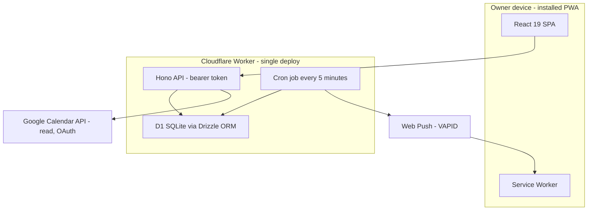

<div align="center">


# Praesto Sum

**_"Praesto sum"_ — Latin for "I am ready, at your service."**

A personal assistant built by a single user, for a single user: organizing tasks and calendar in one place, instead of relying on a handful of apps that never talk to each other.

[](documentation/50-planning/roadmap.md)
[](documentation/50-planning/roadmap.md)
[](#-tech-stack)
[](#-license)

</div>

---

## 📖 About the project

Most people end up organizing their life across a scattered set of tools: a calendar app for events, one or more task apps for to-dos, plus loose notes somewhere in between. Each tool holds a fragment of the picture; none holds the whole of it. The result is duplicated effort, things falling through the cracks, and the user adapting to the tool's model instead of the other way around.

**Praesto Sum** exists to fix that for its one and only user: an assistant that starts with the basics (tasks and calendar) and grows, one "Life Area" at a time, into the single trusted view of everything that needs organizing. The product principles:

1. **Simplicity over completeness** — a small set of features that work every day beats a large catalog that mostly sits idle.
2. **The owner's data stays under the owner's control** — explicit storage choices, with guaranteed local export.
3. **Sustainable for one person to maintain** — complexity that a single person cannot carry is out of scope.
4. **The assistant adapts to the owner, not the other way around.**
5. **Effortless in, effortless out** — capturing and finding information must be near-instant.
6. **Honest mirror** — repeatedly missed commitments are shown, never hidden.

📚 The full product and architecture rationale lives in [`documentation/`](documentation/README.md) — vision, requirements, architecture decision records (ADRs) and roadmap, all validated by the project owner before becoming code.

## ✨ Features

| Feature | Status | Description |
|---|:---:|---|
| **Installable app (PWA)** | ✅ | Icon on the phone's home screen, works like a native app |
| **Quick task capture** | ✅ | Create, list, complete, edit and delete tasks with near-zero friction |
| **Task detail** | ✅ | Title, description, deadline, scheduled date, priority |
| **"Today" view** | 🚧 | What needs attention today: overdue, today, upcoming and undated — with filters by status, date and priority |
| **Google Calendar (read)** | 🚧 | Real Google commitments appear next to tasks, after a one-time authorization, with disconnect available anytime |
| **Data export** | 📋 | One click downloads 100% of the data as JSON + `.ics`, always under the owner's control |
| **Push notifications** | 📋 | The phone rings even with the app closed |
| **Reminders** | 📋 | "Drink water at 3pm" or "warn me 1h before this deadline", delivered on time |
| **Task recurrence** | 📋 | Recurring series with misses recorded, never hidden |
| **Google Calendar (write)** | 📋 | Create/edit events directly from Praesto (Phase 2) |
| **New Life Areas** | 💭 | Notes and other areas, beyond Tasks and Calendar |

✅ shipped · 🚧 in progress · 📋 planned · 💭 future idea — full breakdown in [`documentation/50-planning/roadmap.md`](documentation/50-planning/roadmap.md).

## 🏗️ Architecture

A single Cloudflare Worker serves everything: the SPA's static assets, the REST API and the notification cron. No separate backend, no sync engine, no offline writes.



**Key patterns** (detailed in [`documentation/30-architecture/architecture-overview.md`](documentation/30-architecture/architecture-overview.md)):

- Types flow from `src/worker/db/schema.ts` (Drizzle) outward; `src/worker/dto.ts` is the single mapping point to the wire contract in `src/shared/api.ts`.
- Domain enums are enforced twice: TypeScript union + SQL `CHECK`.
- No multi-user accounts — a single bearer token protects the whole API.

## 🧰 Tech stack

| Layer | Technology |
|---|---|
| Runtime | [Cloudflare Workers](https://workers.cloudflare.com/) (free plan) + D1 + cron triggers |
| Frontend | React 19 + TypeScript (strict) + Vite + `vite-plugin-pwa` |
| API | [Hono](https://hono.dev/) 4, bearer token on every route |
| Database | Cloudflare D1 (SQLite) via [Drizzle ORM](https://orm.drizzle.team/) |
| Notifications | `web-push` (VAPID) under `nodejs_compat` |
| Testing | Vitest + `@cloudflare/vitest-pool-workers` |
| Quality | TypeScript strict, ESLint, Prettier |
| Dev container (optional) | Docker Compose ([ADR-0012](documentation/60-decisions/ADR-0012-optional-docker-compose-local-dev-runtime.md)) |

Exact pinned versions (no `^`/`~`) in [`package.json`](package.json) — upgrades are deliberate events, never accidental.

## 🚀 Getting started

### Prerequisites

- **Node.js 24+** (bundles npm)
- **git**
- A [Cloudflare](https://dash.cloudflare.com/sign-up) account (free plan) — only needed for deploys and remote migrations; local development doesn't need it
- *(optional)* [Docker Desktop](https://www.docker.com/products/docker-desktop/), if you prefer the [containerized environment](documentation/40-engineering/dev-environment.md#the-dev-container--the-optional-second-door-adr-0012)

### Step by step

```bash
# 1. Clone the repository
git clone https://github.com/fabiombarreto/praesto-sum.git
cd praesto-sum

# 2. Install dependencies (exact versions from the lockfile)
npm ci

# 3. Set up local environment variables
cp .dev.vars.example .dev.vars
```

Edit the generated `.dev.vars`:

```bash
# Any string — it's the "token" you paste into the app once per device
API_BEARER_TOKEN="choose-a-random-string"

# Generate with: npx web-push generate-vapid-keys --json
VAPID_SUBJECT="mailto:you@example.com"
VAPID_PUBLIC_KEY="..."
VAPID_PRIVATE_KEY="..."

# Optional at this stage — only needed for the Google Calendar integration
GOOGLE_CLIENT_ID=
GOOGLE_CLIENT_SECRET=
GOOGLE_REDIRECT_URI=
```

```bash
# 4. Apply migrations to the local D1 database
npm run db:migrate

# 5. Run everything in one process: Vite HMR + real workerd + local D1
npm run dev
```

Open **http://127.0.0.1:5173** — the app already works as a PWA (installable from the browser).

> Alternative: `npm run docker:up` brings up the same environment inside Docker Compose (survives a reboot, has its own `status`/`down`). Details in [`documentation/40-engineering/dev-environment.md`](documentation/40-engineering/dev-environment.md#the-dev-container--the-optional-second-door-adr-0012).

## 🕹️ Usage

1. Open the app in a browser (or install it on the home screen — "Add to home screen"/"Install app").
2. On first use, paste the `API_BEARER_TOKEN` you defined — this authenticates the device, with no account or password needed.
3. Capture a task straight from the **Today** screen: title is the only required field.
4. Open the task to add a description, deadline, date and priority, complete, reopen or delete it.
5. Filter by status, date or priority to quickly answer "what do I need to do today?".

## 🧪 Essential commands

| Command | What it does |
|---|---|
| `npm run dev` | Full development environment (HMR + real Worker + local D1) |
| `npm test` | Runs the test suite (Vitest) |
| `npm run check` | Quality gate: types + `tsc -b` + lint + formatting |
| `npm run db:generate` | Generates a migration from a schema change (Drizzle) |
| `npm run db:migrate` | Applies migrations to the local D1 database |
| `npm run build` | Production build (client + Worker + service worker) |
| `npm run deploy` | Build + `wrangler deploy` (assets + API + cron, one Worker) |

Full list and the deploy runbook in [`documentation/40-engineering/dev-environment.md`](documentation/40-engineering/dev-environment.md).

## 📂 Project structure

```
src/
├── app/          # React SPA (screens, components, hooks, PWA)
├── worker/       # Hono API, Drizzle schema, push, Google integration
└── shared/       # API contract shared between app and worker
documentation/    # Source of truth: vision, requirements, ADRs, roadmap
migrations/       # SQL migrations generated by drizzle-kit
```

## 📄 Documentation

This README is the entry point. The project is **documentation-first**: every requirement, decision and domain rule is recorded before it becomes code.

- [`documentation/README.md`](documentation/README.md) — full document map
- [`documentation/10-product/vision.md`](documentation/10-product/vision.md) — problem, vision and principles
- [`documentation/20-requirements/functional-requirements.md`](documentation/20-requirements/functional-requirements.md) — what the system must do
- [`documentation/60-decisions/index.md`](documentation/60-decisions/index.md) — architecture decision records (ADRs)
- [`documentation/50-planning/roadmap.md`](documentation/50-planning/roadmap.md) — where the project stands and what's next

## 👤 Author

Personal project by **[Fabio Barreto](https://github.com/fabiombarreto)** — built for personal use, with the code kept open for anyone who wants to learn from it or adapt the idea.

## 📜 License

Personal project with no formal open-source license. The code is public for reading and reference; reach out to the author before reusing it.
