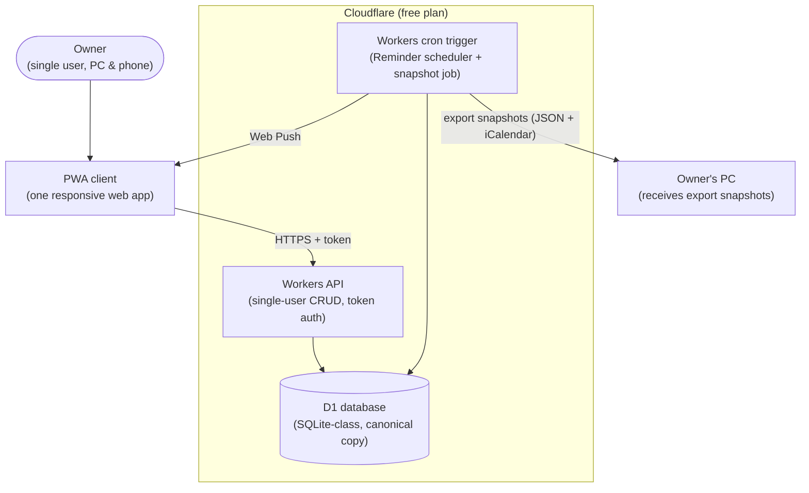

# Architecture Overview

> **Purpose:** The technical shape of the system — drivers, C4 context and containers, data, integrations and risks — with every unresolved area marked as an explicit gap.
> **Update when:** A pending decision from the queue is resolved (new ADR), or the stack, a component, the data model posture or an integration changes.

This document is born mostly empty by design. Phase 0 is documentation-first: the structure below shows *where* each answer will live, and each gap points at the decision that will fill it. See the [pending decisions queue](../60-decisions/index.md).

## Architecture drivers

> Draft — derived from the quality attribute scenarios and constraints being written in parallel; pending owner validation.

The top drivers, in rough priority order:

| Driver | Meaning here | Source |
|---|---|---|
| Privacy and data ownership | Personal life data stays under the owner's control; no third party is entitled to it | QA-001 in [quality-attributes.md](../20-requirements/quality-attributes.md); CON-005 in [constraints.md](../20-requirements/constraints.md) |
| Operational simplicity | One person operates this; nothing that needs babysitting | QA-002 in [quality-attributes.md](../20-requirements/quality-attributes.md) |
| Low cost | Personal project; running cost must stay near zero | QA-003 in [quality-attributes.md](../20-requirements/quality-attributes.md); CON-004 in [constraints.md](../20-requirements/constraints.md) |
| Solo sustainability | A single developer must be able to maintain, debug and evolve it after long pauses | QA-004 in [quality-attributes.md](../20-requirements/quality-attributes.md); CON-002 and CON-006 in [constraints.md](../20-requirements/constraints.md) |

The order in which the resulting decisions are taken is owned by the [pending decisions queue](../60-decisions/index.md).

## System context (C4 level 1)

> Draft — the calendar provider is a candidate integration, not a decided one.

The only confirmed actor is the owner. The external calendar provider is shown dashed because it is **candidate — pending decision** (decision 4 in the [pending decisions queue](../60-decisions/index.md)).

## Containers (C4 level 2)

> Shape fixed by [ADR-0003](../60-decisions/ADR-0003-store-canonical-data-in-cloudflare-d1.md) and [ADR-0004](../60-decisions/ADR-0004-single-pwa-as-sole-interface.md); implementation stack fixed by [ADR-0005](../60-decisions/ADR-0005-implementation-stack-react-vite-hono-drizzle.md) (React SPA + Vite, Hono, Drizzle over D1).

There is deliberately no merge, sync, or offline-write logic anywhere in the system (ADR-0003, safeguard 3).

## Data and persistence

Canonical copy in Cloudflare D1 (SQLite-class managed database), per [ADR-0003](../60-decisions/ADR-0003-store-canonical-data-in-cloudflare-d1.md). Binding safeguards: day-1 export of 100% of the data (JSON + iCalendar, FR-042); automated export snapshots landing on the owner's PC so Cloudflare never holds the only copy (FR-043); no offline write queue without a superseding ADR.

> **Mechanism clarification (2026-08-03).** ADR-0003 phrases safeguard 2 as snapshots being "shipped off the server" to the owner's PC. A Worker cannot reach a home machine, so the direction is inverted in implementation: **the PC pulls** — a local script on a Windows Scheduled Task calls the authenticated export endpoint and stores the file (roadmap chore C5). The ADR's intent is unchanged and fully met: a recent local copy always exists, and the provider never holds the only copy. This is an implementation note, not an amendment — accepted ADRs are append-only.

## External integrations

- Web Push (VAPID) delivers Reminder notifications to the installed PWA — part of [ADR-0003](../60-decisions/ADR-0003-store-canonical-data-in-cloudflare-d1.md).
- External calendar integration (e.g. Google Calendar sync): TBD — see the pending decisions queue in [60-decisions/index.md](../60-decisions/index.md) (decision 4).

## Security and privacy of personal data

> Draft principles only — pending owner validation; implementation details follow the storage decision.

- The owner's personal data remains under the owner's control at all times.
- No personal data is shared with third parties without an explicit, recorded decision (an ADR).
- Any future sync or integration must be opt-in and reversible — the owner can always get all data out.
- Recorded consent ([ADR-0003](../60-decisions/ADR-0003-store-canonical-data-in-cloudflare-d1.md)): Cloudflare can technically read D1 contents (no E2EE). Accepted under CON-005's explicit-revocable-consent clause, mitigated by mandatory local snapshots and a guaranteed exit path; field-level encryption is a possible future ADR.
- API access requires an authentication token on every route (single user); the only unauthenticated surface is the PWA shell.
- Threat model details: TBD — refined with decisions 2–3 in the [pending decisions queue](../60-decisions/index.md).

## Risks and known technical debt

| Risk | Why it is real now | Mitigation |
|---|---|---|
| Documentation rot | The project is documentation-only; docs that drift from reality poison every future session | Maintenance map and audit ritual in the [README](../README.md); `review_trigger` on every doc |
| Decision paralysis in Phase 0 | Four interdependent decisions pending with no code to force a choice | Fixed decision order in the [pending decisions queue](../60-decisions/index.md); each decision closes with an ADR, never re-litigated |

No technical debt exists yet — there is no code.

## Key decisions

| Topic | Decision |
|---|---|
| Documentation and artifact language | [ADR-0001](../60-decisions/ADR-0001-write-all-artifacts-in-english.md) — all artifacts in English |
| Data storage and ownership posture | [ADR-0003](../60-decisions/ADR-0003-store-canonical-data-in-cloudflare-d1.md) — canonical data in Cloudflare D1 behind Workers, mandatory local snapshots |
| Interface type | [ADR-0004](../60-decisions/ADR-0004-single-pwa-as-sole-interface.md) — single installable PWA as the sole MVP interface |
| Implementation stack (PWA framework, D1 layer, tooling) | [ADR-0005](../60-decisions/ADR-0005-implementation-stack-react-vite-hono-drizzle.md) — React 19 SPA + Vite + Hono + Drizzle ORM |
| External calendar integration posture | TBD — decision 4 in the [pending decisions queue](../60-decisions/index.md) |
