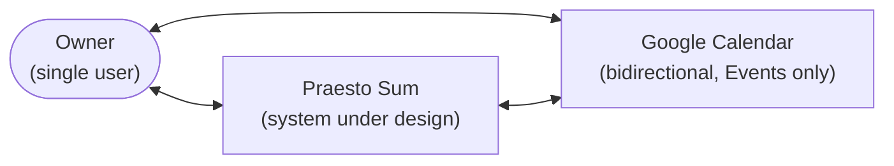

# Architecture Overview

> **Purpose:** The technical shape of the system — drivers, C4 context and containers, data, integrations and risks — with every unresolved area marked as an explicit gap.
> **Update when:** A pending decision from the queue is resolved (new ADR), or the stack, a component, the data model posture or an integration changes.

Written during Phase 0 as a mostly-empty shape with each gap pointing at the decision that would fill it. All of those decisions are now resolved (ADR-0003..0007) and the [pending decisions queue](../60-decisions/index.md) is empty; what remains marked TBD below is genuinely undecided, not merely unwritten.

## Architecture drivers

> Draft — derived from the quality attribute scenarios and constraints being written in parallel; pending owner validation.

The top drivers, in rough priority order:

| Driver | Meaning here | Source |
|---|---|---|
| Privacy and data ownership | Personal life data stays under the owner's control; no third party is entitled to it | QA-001 in [quality-attributes.md](../20-requirements/quality-attributes.md); CON-005 in [constraints.md](../20-requirements/constraints.md) |
| Operational simplicity | One person operates this; nothing that needs babysitting | QA-002 in [quality-attributes.md](../20-requirements/quality-attributes.md) |
| Low cost | Personal project; running cost must stay near zero | QA-003 in [quality-attributes.md](../20-requirements/quality-attributes.md); CON-004 in [constraints.md](../20-requirements/constraints.md) |
| Solo sustainability | A single developer must be able to maintain, debug and evolve it after long pauses | QA-004 in [quality-attributes.md](../20-requirements/quality-attributes.md); CON-002 and CON-006 in [constraints.md](../20-requirements/constraints.md) |

The order in which the resulting decisions are taken is owned by the [pending decisions queue](../60-decisions/index.md).

## System context (C4 level 1)

> Google Calendar is a decided, bidirectional integration since 2026-08-04 ([ADR-0007](../60-decisions/ADR-0007-google-calendar-bidirectional-sync.md)).

Two actors now: the owner, and Google Calendar as a confirmed bidirectional integration ([ADR-0007](../60-decisions/ADR-0007-google-calendar-bidirectional-sync.md)). The owner keeps using Google directly (phone lock screen, car, watch, sharing with other people); Praesto mirrors **Events only**, in both directions.

## Containers (C4 level 2)

> Shape fixed by [ADR-0003](../60-decisions/ADR-0003-store-canonical-data-in-cloudflare-d1.md) and [ADR-0004](../60-decisions/ADR-0004-single-pwa-as-sole-interface.md); implementation stack fixed by [ADR-0005](../60-decisions/ADR-0005-implementation-stack-react-vite-hono-drizzle.md) (React SPA + Vite, Hono, Drizzle over D1).

There is deliberately no merge, sync, or offline-write logic anywhere in the system (ADR-0003, safeguard 3).

## Data and persistence

Canonical copy in Cloudflare D1 (SQLite-class managed database), per [ADR-0003](../60-decisions/ADR-0003-store-canonical-data-in-cloudflare-d1.md). Binding safeguards: day-1 export of 100% of the data (JSON + iCalendar, FR-042); automated export snapshots landing on the owner's PC so Cloudflare never holds the only copy (FR-043); no offline write queue without a superseding ADR.

> **Mechanism clarification (2026-08-03).** ADR-0003 phrases safeguard 2 as snapshots being "shipped off the server" to the owner's PC. A Worker cannot reach a home machine, so the direction is inverted in implementation: **the PC pulls** — a local script on a Windows Scheduled Task calls the authenticated export endpoint and stores the file (roadmap chore C5). The ADR's intent is unchanged and fully met: a recent local copy always exists, and the provider never holds the only copy. This is an implementation note, not an amendment — accepted ADRs are append-only.

### The Task read contract is frozen (2026-08-15, unit 2)

The Task wire contract had one consumer when it was written and has eleven by
the end of the roadmap (units 3, 5, 8, 9, 10, 11, 13, 14, 20). Unit 2
`task-detail-and-dates` is the contract-freeze point, so the shape those units
inherit is fixed rather than negotiated one unit at a time.

Three commitments are load-bearing. **Ordering is produced by the API** — overdue,
then today, then future ascending, then undated last — because it is the one
guarantee every consumer must agree on, and a client-side sort is the one place
they cannot share it. **Paging is `limit`-only**: no cursor, a hard cap of 500,
and an invalid `limit` rejected rather than clamped, so adding a cursor later is
additive rather than a reshape. **Adding a field stays backward-compatible;
renaming, removing or retyping one does not** — that asymmetry is what the
freeze actually protects, and it is why `updatedAt` and `detached` are
deliberately absent from the wire.

The full contract — the ordering key, the filter vocabulary reserved for unit 3,
and the paging revisit trigger — is recorded in
[`docs/api-reference.md`](../../docs/api-reference.md), which is the document
the PWA and every later unit code against.

## External integrations

- Web Push (VAPID) delivers Reminder notifications to the installed PWA — part of [ADR-0003](../60-decisions/ADR-0003-store-canonical-data-in-cloudflare-d1.md).
- **Google Calendar, bidirectional for Events** — decided by [ADR-0007](../60-decisions/ADR-0007-google-calendar-bidirectional-sync.md). OAuth with a long-lived refresh token stored as a Worker secret; scope `calendar.events` (never `calendar`); **polling** on the existing cron, never `events.watch` webhooks (they would need a public unauthenticated route, breaching ADR-0003 safeguard 4). Pull is incremental with Google's own `syncToken`; writes carry `If-Match` and a deterministic id so a retry cannot duplicate. Only Events cross — the mirror inventory is closed and enforced by construction.

> **Spike findings (2026-08-11, chore C11).** The access spike ran against the owner's real
> Google account and corrected three things ADR-0007 had assumed. Accepted ADRs are
> append-only, so the corrections live here.
>
> 1. **Publishing a sensitive Calendar scope needs no verification submission.** The
>    `praesto-sum` project sits at publishing status *In production*, audience *External*,
>    with `calendar.events` and `calendar.events.readonly` both registered as sensitive.
>    Adding the sensitive scope raised a dialog titled "Verification required" whose body
>    says verification is needed only to avoid the unverified-app screen, and whose sole
>    action is *Continue* — a warning, not a gate. Both consequences ADR-0007 accepted in
>    advance materialized: the unverified-app screen appeared once at consent, and the
>    console shows the 100-user cap (1/100). Chore **C13 is therefore not triggered**. The
>    OAuth client is a *Web application* one and Google accepted
>    `https://praesto.fabiobarreto.workers.dev/oauth/callback` as a redirect URI with no
>    authorized or verified domain — a `workers.dev` origin is enough for OAuth.
> 2. **`calendarList.list` is unreachable with `calendar.events.readonly`** — it answers
>    `403 insufficient authentication scopes`. FR-027 ("he chooses which calendars are
>    included") therefore needs either an additional scope
>    (`calendar.calendarlist.readonly` — sensitive, not restricted, so it does not change
>    the verification category settled above) or a narrower unit 4 that reads `primary`
>    only. **Unit 4's PRD must decide this**: it is the one place where ADR-0007's read-only
>    scope set is demonstrably insufficient for the requirement it serves.
> 3. **The free-plan ceiling does not bite at the owner's real scale.** Measured against the
>    primary calendar (the only one reachable, per finding 2): **401 events** across all
>    history arrive in **one** page — one subrequest — costing **4.45 ms** of CPU to parse
>    and content-hash, against free-plan limits of **50 subrequests and 10 ms CPU** per
>    invocation. A ±12-month window is 47 events and 0.66 ms. ADR-0007's bounded,
>    resumable, one-page-per-tick backfill remains the right design as a safety property,
>    but it is not load-bearing at this scale. `nextSyncToken` came back on the final page
>    in **both** modes, including the bounded window; sending a syncToken back with frozen
>    query parameters was **not** tested and remains unit 4's to verify.
>
> A fourth observation, recorded because it is the cheapest way to lose a day later: **the
> console contradicts itself.** With both sensitive scopes registered and "Approval
> required" shown on *Data access*, the *Verification centre* still reads "Verification is
> not necessary because your app is not requesting sensitive or restricted scopes", and it
> survives a hard reload. That is the same contradiction as the two official documentation
> pages ADR-0007 cites — now reproducible inside a single project.

## Security and privacy of personal data

> Draft principles only — pending owner validation; implementation details follow the storage decision.

- The owner's personal data remains under the owner's control at all times.
- No personal data is shared with third parties without an explicit, recorded decision (an ADR).
- Any future sync or integration must be opt-in and reversible — the owner can always get all data out.
- Recorded consent ([ADR-0003](../60-decisions/ADR-0003-store-canonical-data-in-cloudflare-d1.md)): Cloudflare can technically read D1 contents (no E2EE). Accepted under CON-005's explicit-revocable-consent clause, mitigated by mandatory local snapshots and a guaranteed exit path; field-level encryption is a possible future ADR.
- API access requires an authentication token on every route (single user); the only unauthenticated surface is the PWA shell.
- Recorded consent ([ADR-0007](../60-decisions/ADR-0007-google-calendar-bidirectional-sync.md)): Google gains continuous programmatic access to the owner's calendar, accepted under the same CON-005 clause and bounded by a **closed mirror inventory** — Events only. Revocation keeps 100% of local data (FR-030).
- Threat model details: TBD — no decision blocks this; it is refined as real surfaces land.

## Risks and known technical debt

| Risk | Why it is real now | Mitigation |
|---|---|---|
| Documentation rot | The project is documentation-only; docs that drift from reality poison every future session | Maintenance map and audit ritual in the [README](../README.md); `review_trigger` on every doc |
| Google OAuth durability | An app in "Testing" publishing status gets refresh tokens expiring every 7 days, which would break QA-002; official docs contradict each other on whether publishing a sensitive scope needs verification first | **Half settled by chore C11 (2026-08-11):** the app is published *In production* with both sensitive Calendar scopes and no verification submission, so the fallback path (own domain, chore C13) is not needed. The token's actual survival past day 7 is still unproven — chore **C12 on or after 2026-08-19** re-runs the spike with the same refresh token and closes this row either way |
| Silent damage to the owner's real Google calendar | Write-back acts on data that lives outside D1 and that Praesto cannot restore on its own | [ADR-0007](../60-decisions/ADR-0007-google-calendar-bidirectional-sync.md): scope never wider than `calendar.events`, deterministic insert ids, `If-Match` on writes, full re-sync as upsert with zero deletions, and a proven restore (chore C6) before every migration over real data |

## Key decisions

| Topic | Decision |
|---|---|
| Documentation and artifact language | [ADR-0001](../60-decisions/ADR-0001-write-all-artifacts-in-english.md) — all artifacts in English |
| Data storage and ownership posture | [ADR-0003](../60-decisions/ADR-0003-store-canonical-data-in-cloudflare-d1.md) — canonical data in Cloudflare D1 behind Workers, mandatory local snapshots |
| Interface type | [ADR-0004](../60-decisions/ADR-0004-single-pwa-as-sole-interface.md) — single installable PWA as the sole MVP interface |
| Implementation stack (PWA framework, D1 layer, tooling) | [ADR-0005](../60-decisions/ADR-0005-implementation-stack-react-vite-hono-drizzle.md) — React 19 SPA + Vite + Hono + Drizzle ORM |
| Recurrence model | [ADR-0006](../60-decisions/ADR-0006-recurrence-model.md) — shared rule; Tasks materialize the current occurrence with `missed` recording, Events expand virtually |
| External calendar posture | [ADR-0007](../60-decisions/ADR-0007-google-calendar-bidirectional-sync.md) — bidirectional Google Calendar sync for Events only, closed mirror inventory |
