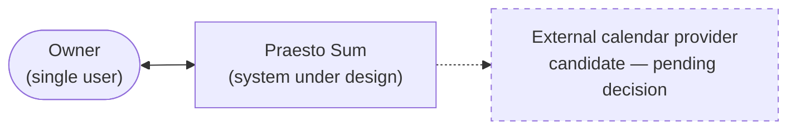

# Architecture Overview

> **Purpose:** The technical shape of the system — drivers, C4 context and containers, data, integrations and risks — with every unresolved area marked as an explicit gap.
> **Update when:** A pending decision from the queue is resolved (new ADR), or the stack, a component, the data model posture or an integration changes.

This document is born mostly empty by design. Phase 0 is documentation-first: the structure below shows *where* each answer will live, and each gap points at the decision that will fill it. See the [pending decisions queue](../60-decisions/index.md).

## Architecture drivers

> Draft — derived from the quality attribute scenarios and constraints being written in parallel; pending owner validation.

The top drivers, in rough priority order:

| Driver | Meaning here | Source |
|---|---|---|
| Privacy and data ownership | Personal life data stays under the owner's control; no third party is entitled to it | QA-001 in [quality-attributes.md](../20-requirements/quality-attributes.md); CON-005 in [constraints.md](../20-requirements/constraints.md) |
| Operational simplicity | One person operates this; nothing that needs babysitting | QA-002 in [quality-attributes.md](../20-requirements/quality-attributes.md) |
| Low cost | Personal project; running cost must stay near zero | QA-003 in [quality-attributes.md](../20-requirements/quality-attributes.md); CON-004 in [constraints.md](../20-requirements/constraints.md) |
| Solo sustainability | A single developer must be able to maintain, debug and evolve it after long pauses | QA-004 in [quality-attributes.md](../20-requirements/quality-attributes.md); CON-002 and CON-006 in [constraints.md](../20-requirements/constraints.md) |

The order in which the resulting decisions are taken is owned by the [pending decisions queue](../60-decisions/index.md).

## System context (C4 level 1)

> Draft — the calendar provider is a candidate integration, not a decided one.

The only confirmed actor is the owner. The external calendar provider is shown dashed because it is **candidate — pending decision** (decision 4 in the [pending decisions queue](../60-decisions/index.md)).

## Containers (C4 level 2)

TBD — see the pending decisions queue in [60-decisions/index.md](../60-decisions/index.md). No stack has been chosen, so no containers exist yet. This section gains a diagram once decisions 1–3 (storage posture, interface type, tech stack) are resolved.

## Data and persistence

TBD — see the pending decisions queue in [60-decisions/index.md](../60-decisions/index.md) (decision 1: data storage and ownership posture — local-first vs cloud, data format).

## External integrations

TBD — see the pending decisions queue in [60-decisions/index.md](../60-decisions/index.md) (decision 4: external calendar integration posture, e.g. Google Calendar sync now vs later).

## Security and privacy of personal data

> Draft principles only — pending owner validation; implementation details follow the storage decision.

- The owner's personal data remains under the owner's control at all times.
- No personal data is shared with third parties without an explicit, recorded decision (an ADR).
- Any future sync or integration must be opt-in and reversible — the owner can always get all data out.
- Threat model, encryption at rest/in transit, and backup posture: TBD — see the pending decisions queue in [60-decisions/index.md](../60-decisions/index.md).

## Risks and known technical debt

| Risk | Why it is real now | Mitigation |
|---|---|---|
| Documentation rot | The project is documentation-only; docs that drift from reality poison every future session | Maintenance map and audit ritual in the [README](../README.md); `review_trigger` on every doc |
| Decision paralysis in Phase 0 | Four interdependent decisions pending with no code to force a choice | Fixed decision order in the [pending decisions queue](../60-decisions/index.md); each decision closes with an ADR, never re-litigated |

No technical debt exists yet — there is no code.

## Key decisions

| Topic | Decision |
|---|---|
| Documentation and artifact language | [ADR-0001](../60-decisions/ADR-0001-write-all-artifacts-in-english.md) — all artifacts in English |
| Data storage and ownership posture | TBD — decision 1 in the [pending decisions queue](../60-decisions/index.md) |
| Interface type | TBD — decision 2 in the [pending decisions queue](../60-decisions/index.md) |
| Programming language and tech stack | TBD — decision 3 in the [pending decisions queue](../60-decisions/index.md) |
| External calendar integration posture | TBD — decision 4 in the [pending decisions queue](../60-decisions/index.md) |
