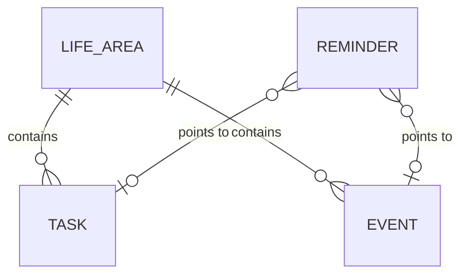

# Domain Model

> **Purpose:** The stack-independent conceptual model — entities, relationships and invariants — that any future implementation must respect.
> **Update when:** A new domain concept appears, an ambiguity is resolved, or the [glossary](../10-product/glossary.md) changes.

The canonical entity names — **Task**, **Event**, **Reminder**, **Life Area** — are defined in the [glossary](../10-product/glossary.md). This document uses exactly those names.

## Entity diagram

> Draft — minimal seed model, pending owner validation.

A Reminder points to at most one Task **or** one Event — never both. Whether a Reminder can exist standalone (with no target) is an open point in the [glossary](../10-product/glossary.md): TBD — pending owner input (see invariants below).

## Entities

> Draft — attribute lists are a seed pending owner validation; nothing here implies a storage format or schema.

### Task

Something the owner intends to do; it has no fixed position on the calendar by itself.

- Title
- Description (optional)
- Due date (optional)
- Status — lifecycle: `open → done`. Additional states (e.g. cancelled): TBD — pending owner input.
- Life Area it belongs to

### Event

Something that occupies a specific position in time on the calendar.

- Title
- Start date/time
- End date/time (or duration)
- Location (optional)
- Life Area it belongs to
- Recurrence: TBD — pending owner input.

### Reminder

A notification the system delivers to the owner about a Task or an Event.

- Target — one Task or one Event (whether a Reminder can exist standalone, with no target: TBD — pending owner input)
- Trigger time (absolute, or relative to the target's due date / start time)
- Delivery channel: TBD — see the pending decisions queue in [60-decisions/index.md](../60-decisions/index.md) (depends on the interface decision).

### Life Area

A named domain of the owner's personal life that groups Tasks and Events.

- Name
- Description (optional)
- Initial set of Life Areas: TBD — pending owner input.

## Domain rules and invariants

> Draft — seed rules and open questions, pending owner validation.

1. A Reminder never points to both a Task and an Event at once. Whether it can exist standalone (with no target at all) is an open point in the [glossary](../10-product/glossary.md): TBD — pending owner input.
2. Does a Task with a due date appear on the calendar alongside Events? TBD — pending owner input.
3. Can a Task or Event exist without a Life Area, or is there a default area (e.g. "Unsorted")? TBD — pending owner input.
4. Can a Task turn into an Event (e.g. when the owner schedules time for it), or are they always distinct? TBD — pending owner input.

## Expected evolution

> Draft — pending owner validation.

The project starts with calendar and tasks and adds other life areas later. The model is designed so that growth is data, not remodeling:

- Adding a new Life Area is creating a new `Life Area` record — it must never require changing the Task, Event or Reminder entities.
- Area-specific concepts that emerge later (e.g. a future health or finance area bringing its own entities) attach to their Life Area as new entities alongside Task and Event, rather than by widening the core entities with area-specific attributes.
- If a future concept genuinely does not fit this shape, that is a glossary + domain-model change with its own ADR, not a silent workaround.
