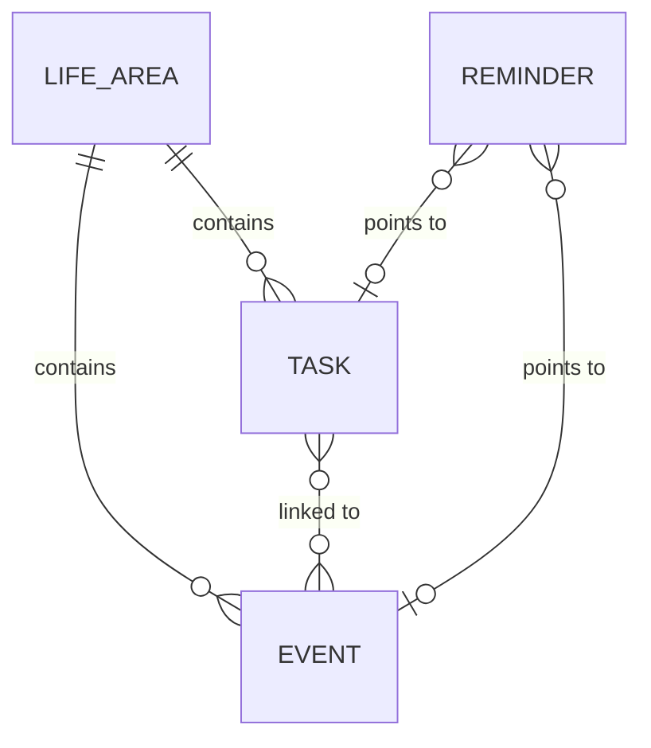

# Domain Model

> **Purpose:** The stack-independent conceptual model — entities, relationships and invariants — that any future implementation must respect.
> **Update when:** A new domain concept appears, an ambiguity is resolved, or the [glossary](../10-product/glossary.md) changes.

The canonical entity names — **Task**, **Event**, **Reminder**, **Life Area** — are defined in the [glossary](../10-product/glossary.md). This document uses exactly those names.

## Entity diagram

> Core relationships validated by the owner on 2026-08-03; attribute lists remain draft.

A Reminder points to at most one Task **or** one Event — never both — and may exist standalone, with no target (resolved 2026-08-03). Tasks and Events never convert into one another; they relate through an N:N link.

## Entities

> Draft — attribute lists are a seed pending owner validation; nothing here implies a storage format or schema.

### Task

Something the owner intends to do; it has no fixed position on the calendar by itself.

- Title
- Description (optional)
- Deadline (optional — date to complete *by*) **or** scheduled date (optional — the specific date it is to be done *on*); distinct semantics, resolved 2026-08-03
- Status — lifecycle: `open → done`. Additional states (e.g. cancelled): TBD — pending owner input.
- Life Area it belongs to
- Linked Events (zero or more — N:N, resolved 2026-08-03)
- Recurrence (confirmed 2026-08-03; shared model designed with the MVP requirements)

### Event

Something that occupies a specific position in time on the calendar.

- Title
- Start date/time
- End date/time (or duration)
- Location (optional)
- Life Area it belongs to
- Linked Tasks (zero or more — N:N, resolved 2026-08-03)
- Recurrence (confirmed 2026-08-03; shared model designed with the MVP requirements)

### Reminder

A notification the system delivers to the owner about a Task or an Event.

- Target — optional: one Task, one Event, or none (standalone Reminders confirmed 2026-08-03)
- Trigger time (absolute, or relative to the target's due date / start time)
- Delivery channel: Web Push to the installed PWA, per [ADR-0003](../60-decisions/ADR-0003-store-canonical-data-in-cloudflare-d1.md) and [ADR-0004](../60-decisions/ADR-0004-single-pwa-as-sole-interface.md).

### Life Area

A named domain of the owner's personal life that groups Tasks and Events.

- Name
- Description (optional)
- Initial set of Life Areas: TBD — pending owner input.

## Domain rules and invariants

> Draft — seed rules and open questions, pending owner validation.

1. A Reminder never points to both a Task and an Event at once; it points to one of them or to nothing (standalone) — resolved 2026-08-03.
2. Does a Task with a deadline or a scheduled date appear on the calendar alongside Events? TBD — pending owner input.
3. Can a Task or Event exist without a Life Area, or is there a default area (e.g. "Unsorted")? TBD — pending owner input.
4. Tasks and Events are always distinct and never convert into one another; they relate through an N:N link — resolved 2026-08-03.

## Expected evolution

> Draft — pending owner validation.

The project starts with calendar and tasks and adds other life areas later. The model is designed so that growth is data, not remodeling:

- Adding a new Life Area is creating a new `Life Area` record — it must never require changing the Task, Event or Reminder entities.
- Area-specific concepts that emerge later (e.g. a future health or finance area bringing its own entities) attach to their Life Area as new entities alongside Task and Event, rather than by widening the core entities with area-specific attributes.
- If a future concept genuinely does not fit this shape, that is a glossary + domain-model change with its own ADR, not a silent workaround.
